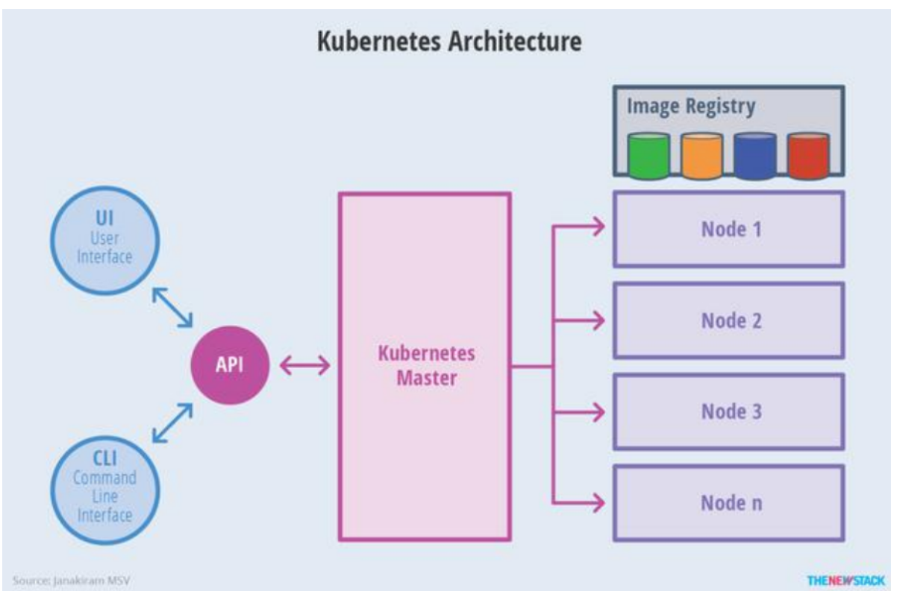
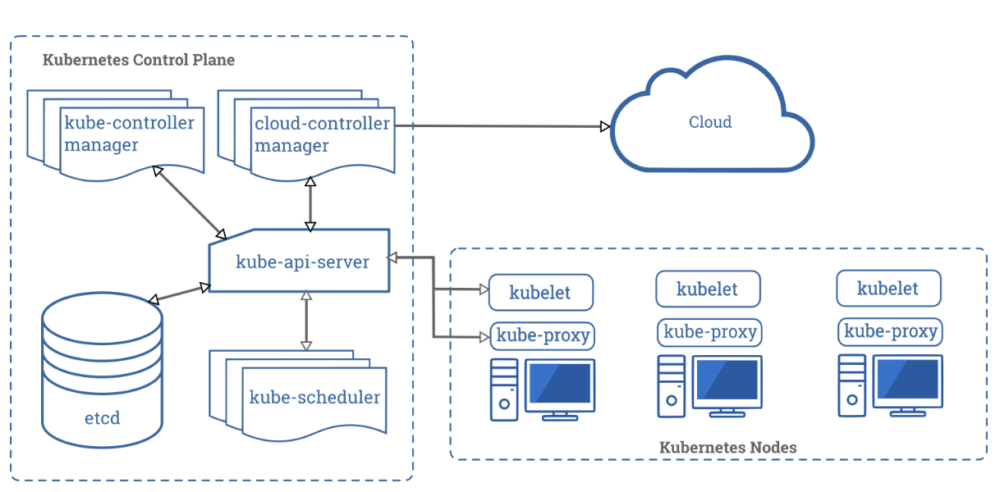
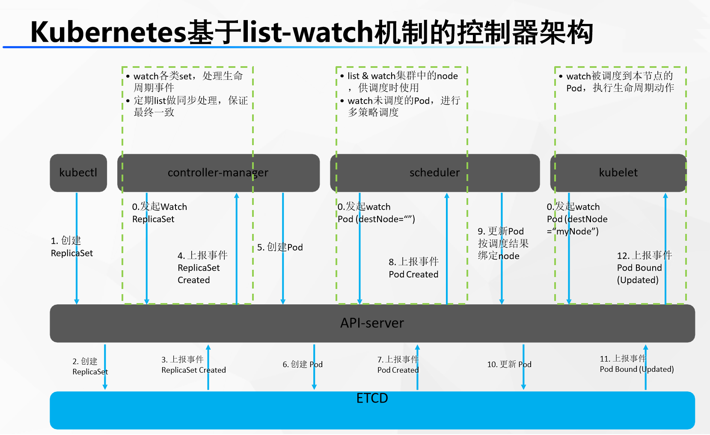

# 1、集群原理

集群：

主从：

- 主从同步/复制  ;mysql 主  -- mysql 从
- 主管理从   v

分片（数据集群）：

- 大家都一样
- 每个人存一部分东西

## 1、master-node 架构

11000台机器

地主+奴隶

地（机器）

奴隶（在机器上干活）

master：主节点（地主）。可能有很多（多人控股公司）

node：work节点（工作节点）。 很多。真正干应用的活

> master 和 worker怎么交互
>
> master决定worker里面都有什么
>
> worker只是和master （API） 通信；  每一个节点自己干自己的活

程序员使用UI或者CLI操作k8s集群的master，就可以知道整个集群的状况。

## 2、工作原理

> master节点（Control Plane【控制面板】）：master节点控制整个集群
>
> master节点上有一些核心组件：
>
> - Controller  Manager：控制管理器
> - etcd：键值数据库（redis）【记账本，记事本】
> - scheduler：调度器
> - api server：api网关（所有的控制都需要通过api-server）
>
> node节点（worker工作节点）：
>
> - kubelet（监工）：每一个node节点上必须安装的组件。
> - kube-proxy：代理。代理网络
>
> 部署一个应用？
>
> 程序员：调用CLI告诉master，我们现在要部署一个tomcat应用
>
> - 程序员的所有调用都先去master节点的网关api-server。这是matser的唯一入口（mvc模式中的c层）
> - 收到的请求先交给master的api-server。由api-server交给controller-mannager进行控制
> - controller-mannager 进行 应用部署
> - controller-mannager 会生成一次部署信息。 tomcat --image:tomcat6 --port 8080 ,真正不部署应用
> - 部署信息被记录在etcd中
> - scheduler调度器从etcd数据库中，拿到要部署的应用，开始调度。看哪个节点合适，
> - scheduler把算出来的调度信息再放到etcd中
> - 每一个node节点的监控kubelet，随时和master保持联系的（给api-server发送请求不断获取最新数据），所有节点的kubelet就会从master
> - 假设node2的kubelet最终收到了命令，要部署。
> - kubelet就自己run一个应用在当前机器上，随时给master汇报当前应用的状态信息，分配ip
> - node和master是通过master的api-server联系的
> - 每一个机器上的kube-proxy能知道集群的所有网络。只要node访问别人或者别人访问node，node上的kube-proxy网络代理自动计算进行流量转发

下图和上图一样的，再理解一下

无论访问哪个机器，都可以访问到真正应用（Service【服务】）

## 3、原理分解

### 1、主节点（master）

> 快速介绍：
>
> - master也要装kubelet和kubeproxy
>
> - 前端访问（UI\CLI）：
> - kube-apiserver：
> - scheduler:
> - controller manager:
> - etcd
> - kubelet+kubeproxy每一个节点的必备+docker（容器运行时环境）

### 2、工作节点（node）

> 快速介绍：
>
> - Pod：
>   - docker run 启动的是一个container（容器），**容器是docker的基本单位**，一个应用是一个容器
>   - kubelet run 启动的一个应用称为一个Pod；**Pod是k8s的基本单位。**
>     - Pod是容器的一个再封装
>     - atguigu(永远不变)    ==slf4j=    log4j(类)
>     - 应用 ===== ==Pod== ======= docker的容器
>     - 一个容器往往代表不了一个基本应用。博客（php+mysql合起来完成）
>     - 准备一个Pod 可以包含多个 container；一个Pod代表一个基本的应用。
>     - IPod（看电影、听音乐、玩游戏）【一个基本产品，原子】；
>     - Pod（music container、movie container）【一个基本产品，原子的】
> - Kubelet：监工，负责交互master的api-server以及当前机器的应用启停等，在master机器就是master的小助手。每一台机器真正干活的都是这个 Kubelet
> - Kube-proxy：
> - 其他：
>   - 

## 2、组件交互原理

> 想让k8s部署一个tomcat？
>
> 0、开机默认所有节点的kubelet、master节点的scheduler（调度器）、controller-manager（控制管理器）一直监听master的api-server发来的事件变化（for ::）
>
> 
>
> 1、程序员使用命令行工具： kubectl ； kubectl create deploy tomcat --image=tomcat8（告诉master让集群使用tomcat8镜像，部署一个tomcat应用）
>
> 2、kubectl命令行内容发给api-server，api-server保存此次创建信息到etcd
>
> 3、etcd给api-server上报事件，说刚才有人给我里面保存一个信息。（部署Tomcat[deploy]）
>
> 4、controller-manager监听到api-server的事件，是 （部署Tomcat[deploy]）
>
> 5、controller-manager 处理这个 （部署Tomcat[deploy]）的事件。controller-manager会生成Pod的部署信息【pod信息】
>
> 6、controller-manager 把Pod的信息交给api-server，再保存到etcd
>
> 7、etcd上报事件【pod信息】给api-server。
>
> 8、scheduler专门监听 【pod信息】 ，拿到 【pod信息】的内容，计算，看哪个节点合适部署这个Pod【pod调度过后的信息（node: node-02）】，
>
> 9、scheduler把 【pod调度过后的信息（node: node-02）】交给api-server保存给etcd
>
> 10、etcd上报事件【pod调度过后的信息（node: node-02）】，给api-server
>
> 11、其他节点的kubelet专门监听 【pod调度过后的信息（node: node-02）】 事件，集群所有节点kubelet从api-server就拿到了 【pod调度过后的信息（node: node-02）】 事件
>
> 12、每个节点的kubelet判断是否属于自己的事情；node-02的kubelet发现是他的事情
>
> 13、node-02的kubelet启动这个pod。汇报给master当前启动好的所有信息

