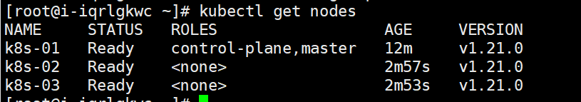

# Kubernetes安装

## 1、理解

安装方式

- 二进制方式（建议生产环境使用）
- MiniKube.....
- kubeadm引导方式（官方推荐）
  - GA


大致流程

- 准备N台服务器，**内网互通**，
- 安装Docker容器化环境【k8s放弃dockershim】
- 安装Kubernetes
  - 三台机器安装核心组件（**kubeadm(创建集群的引导工具)**,  ***kubelet***，**kubectl（程序员用的命令行）**  ）
  - kubelet可以直接通过容器化的方式创建出之前的核心组件（api-server）【官方把核心组件做成镜像】
  - 由kubeadm引导创建集群


## 2、执行

### 1、准备机器

- 开通三台机器，内网互通，配置公网ip。centos7.8/7.9，基础实验2c4g三台也可以
- 每台机器的hostname不要用localhost，可用k8s-01，k8s-02，k8s-03之类的【不包含下划线、小数点、大写字母】（这个后续步骤也可以做）

#### 2、安装前置环境（都执行）

##### 1、基础环境

```sh
#########################################################################
#关闭防火墙： 如果是云服务器，需要设置安全组策略放行端口
# https://kubernetes.io/zh/docs/setup/production-environment/tools/kubeadm/install-kubeadm/#check-required-ports
systemctl stop firewalld
systemctl disable firewalld

# 修改 hostname
hostnamectl set-hostname k8s-01
# 查看修改结果
hostnamectl status
# 设置 hostname 解析
echo "127.0.0.1   $(hostname)" >> /etc/hosts

#关闭 selinux： 
sed -i 's/enforcing/disabled/' /etc/selinux/config
setenforce 0

#关闭 swap：
swapoff -a  
sed -ri 's/.*swap.*/#&/' /etc/fstab 

#允许 iptables 检查桥接流量
#https://kubernetes.io/zh/docs/setup/production-environment/tools/kubeadm/install-kubeadm/#%E5%85%81%E8%AE%B8-iptables-%E6%A3%80%E6%9F%A5%E6%A1%A5%E6%8E%A5%E6%B5%81%E9%87%8F
## 开启br_netfilter
## sudo modprobe br_netfilter
## 确认下
## lsmod | grep br_netfilter

## 修改配置


#####这里用这个，不要用课堂上的配置。。。。。。。。。
#将桥接的 IPv4 流量传递到 iptables 的链：
# 修改 /etc/sysctl.conf
# 如果有配置，则修改
sed -i "s#^net.ipv4.ip_forward.*#net.ipv4.ip_forward=1#g"  /etc/sysctl.conf
sed -i "s#^net.bridge.bridge-nf-call-ip6tables.*#net.bridge.bridge-nf-call-ip6tables=1#g"  /etc/sysctl.conf
sed -i "s#^net.bridge.bridge-nf-call-iptables.*#net.bridge.bridge-nf-call-iptables=1#g"  /etc/sysctl.conf
sed -i "s#^net.ipv6.conf.all.disable_ipv6.*#net.ipv6.conf.all.disable_ipv6=1#g"  /etc/sysctl.conf
sed -i "s#^net.ipv6.conf.default.disable_ipv6.*#net.ipv6.conf.default.disable_ipv6=1#g"  /etc/sysctl.conf
sed -i "s#^net.ipv6.conf.lo.disable_ipv6.*#net.ipv6.conf.lo.disable_ipv6=1#g"  /etc/sysctl.conf
sed -i "s#^net.ipv6.conf.all.forwarding.*#net.ipv6.conf.all.forwarding=1#g"  /etc/sysctl.conf
# 可能没有，追加
echo "net.ipv4.ip_forward = 1" >> /etc/sysctl.conf
echo "net.bridge.bridge-nf-call-ip6tables = 1" >> /etc/sysctl.conf
echo "net.bridge.bridge-nf-call-iptables = 1" >> /etc/sysctl.conf
echo "net.ipv6.conf.all.disable_ipv6 = 1" >> /etc/sysctl.conf
echo "net.ipv6.conf.default.disable_ipv6 = 1" >> /etc/sysctl.conf
echo "net.ipv6.conf.lo.disable_ipv6 = 1" >> /etc/sysctl.conf
echo "net.ipv6.conf.all.forwarding = 1"  >> /etc/sysctl.conf
# 执行命令以应用
sysctl -p


#################################################################

```

#### 2、docker环境

```sh
sudo yum remove docker*
sudo yum install -y yum-utils
#配置docker yum 源
sudo yum-config-manager --add-repo http://mirrors.aliyun.com/docker-ce/linux/centos/docker-ce.repo
#安装docker 19.03.9
yum install -y  docker-ce-3:20.10.9-3.el7.x86_64 docker-ce-cli-3:20.10.9-3.el7.x86_64 containerd.io

#启动服务
systemctl start docker
systemctl enable docker

#配置加速
sudo mkdir -p /etc/docker
sudo tee /etc/docker/daemon.json <<-'EOF'
{
  "registry-mirrors": ["https://82m9ar63.mirror.aliyuncs.com"],
  "exec-opts": ["native.cgroupdriver=systemd"]
}
EOF
sudo systemctl daemon-reload
sudo systemctl restart docker
```


### 3、安装k8s核心（都执行）

```sh
# 配置K8S的yum源
cat <<EOF > /etc/yum.repos.d/kubernetes.repo
[kubernetes]
name=Kubernetes
baseurl=http://mirrors.aliyun.com/kubernetes/yum/repos/kubernetes-el7-x86_64
enabled=1
gpgcheck=0
repo_gpgcheck=0
gpgkey=http://mirrors.aliyun.com/kubernetes/yum/doc/yum-key.gpg
       http://mirrors.aliyun.com/kubernetes/yum/doc/rpm-package-key.gpg
EOF

# 卸载旧版本
yum remove -y kubelet kubeadm kubectl

# 查看可以安装的版本
yum list kubelet --showduplicates | sort -r

# 安装kubelet、kubeadm、kubectl 指定版本
yum install -y kubelet-1.21.0 kubeadm-1.21.0 kubectl-1.21.0

# 开机启动kubelet
systemctl enable kubelet && systemctl start kubelet
```


### 4、初始化master节点（master执行）

```sh
############下载核心镜像 kubeadm config images list：查看需要哪些镜像###########


docker pull registry.aliyuncs.com/google_containers/coredns:v1.8.0
docker tag registry.aliyuncs.com/google_containers/coredns:v1.8.0 registry.aliyuncs.com/google_containers/coredns/coredns:v1.8.0

####封装成images.sh文件
#!/bin/bash
images=(
  kube-apiserver:v1.21.0
  kube-proxy:v1.21.0
  kube-controller-manager:v1.21.0
  kube-scheduler:v1.21.0
  coredns:v1.8.0
  etcd:3.4.13-0
  pause:3.4.1
)
for imageName in ${images[@]} ; do
    docker pull registry.cn-hangzhou.aliyuncs.com/lfy_k8s_images/$imageName
done
#####封装结束

chmod +x images.sh && ./images.sh


# registry.cn-hangzhou.aliyuncs.com/lfy_k8s_images/coredns:v1.8.0

##注意1.21.0版本的k8s coredns镜像比较特殊，结合阿里云需要特殊处理，重新打标签
docker tag registry.cn-hangzhou.aliyuncs.com/lfy_k8s_images/coredns:v1.8.0 registry.cn-hangzhou.aliyuncs.com/lfy_k8s_images/coredns/coredns:v1.8.0

########kubeadm init 一个master########################
########kubeadm join 其他worker########################
kubeadm init \
--apiserver-advertise-address=10.170.11.8 \
--image-repository registry.aliyuncs.com/google_containers \
--kubernetes-version v1.21.0 \
--service-cidr=10.96.0.0/16 \
--pod-network-cidr=192.168.0.0/16
## 注意：pod-cidr与service-cidr
# cidr 无类别域间路由（Classless Inter-Domain Routing、CIDR）
# 指定一个网络可达范围  pod的子网范围+service负载均衡网络的子网范围+本机ip的子网范围不能有重复域


######按照提示继续######
## init完成后第一步：复制相关文件夹
To start using your cluster, you need to run the following as a regular user:

  mkdir -p $HOME/.kube
  sudo cp -i /etc/kubernetes/admin.conf $HOME/.kube/config
  sudo chown $(id -u):$(id -g) $HOME/.kube/config

## 导出环境变量
Alternatively, if you are the root user, you can run:

  export KUBECONFIG=/etc/kubernetes/admin.conf


### 部署一个pod网络
You should now deploy a pod network to the cluster.
Run "kubectl apply -f [podnetwork].yaml" with one of the options listed at:
  https://kubernetes.io/docs/concepts/cluster-administration/addons/
  ##############如下：安装calico#####################
  
curl https://docs.projectcalico.org/archive/v3.19/manifests/calico.yaml -O

kubectl apply -f calico.yaml


### 命令检查
kubectl get pod -A  ##获取集群中所有部署好的应用Pod
kubectl get nodes  ##查看集群所有机器的状态
 

Then you can join any number of worker nodes by running the following on each as root:

kubeadm join 172.24.80.222:6443 --token nz9azl.9bl27pyr4exy2wz4 \
	--discovery-token-ca-cert-hash sha256:4bdc81a83b80f6bdd30bb56225f9013006a45ed423f131ac256ffe16bae73a20 
```

### 5、初始化worker节点（worker执行）

```sh
## 用master生成的命令即可

kubeadm join 172.24.80.222:6443 --token nz9azl.9bl27pyr4exy2wz4 \
	--discovery-token-ca-cert-hash sha256:4bdc81a83b80f6bdd30bb56225f9013006a45ed423f131ac256ffe16bae73a20 
	
	

##过期怎么办
kubeadm token create --print-join-command
kubeadm token create --ttl 0 --print-join-command
kubeadm join --token y1eyw5.ylg568kvohfdsfco --discovery-token-ca-cert-hash sha256: 6c35e4f73f72afd89bf1c8c303ee55677d2cdb1342d67bb23c852aba2efc7c73
```




### 6、验证集群

```sh
#获取所有节点
kubectl get nodes

#给节点打标签
## k8s中万物皆对象。node:机器  Pod：应用容器
###加标签  《h1》
kubectl label node k8s-02 node-role.kubernetes.io/worker=''
###去标签
kubectl label node k8s-02 node-role.kubernetes.io/worker-


## k8s集群，机器重启了会自动再加入集群，master重启了会自动再加入集群控制中心
```


### 7、设置ipvs模式

k8s整个集群为了访问通；默认是用iptables,性能下（kube-proxy在集群之间同步iptables的内容）


```sh
#1、查看默认kube-proxy 使用的模式
kubectl logs -n kube-system kube-proxy-28xv4
#2、需要修改 kube-proxy 的配置文件,修改mode 为ipvs。默认iptables，但是集群大了以后就很慢
kubectl edit cm kube-proxy -n kube-system
修改如下
   ipvs:
      excludeCIDRs: null
      minSyncPeriod: 0s
      scheduler: ""
      strictARP: false
      syncPeriod: 30s
    kind: KubeProxyConfiguration
    metricsBindAddress: 127.0.0.1:10249
    mode: "ipvs"
 ###修改了kube-proxy的配置，为了让重新生效，需要杀掉以前的Kube-proxy
 kubectl get pod -A|grep kube-proxy
 kubectl delete pod kube-proxy-pqgnt -n kube-system
### 修改完成后可以重启kube-proxy以生效
```
